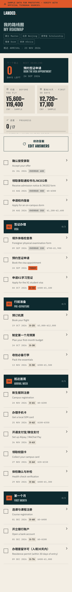
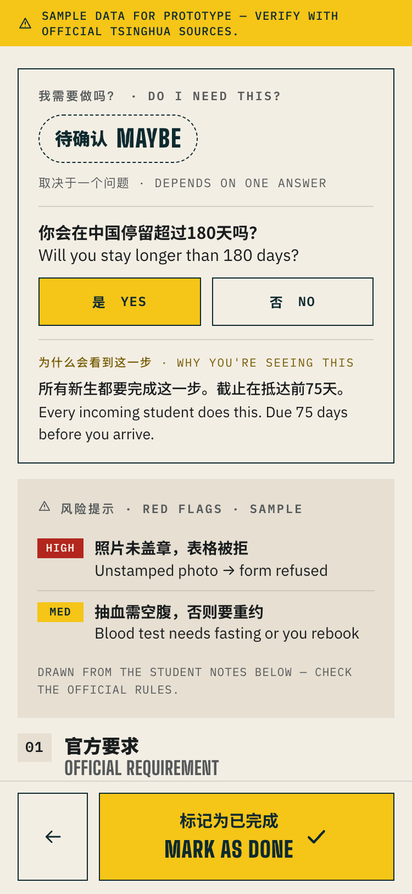
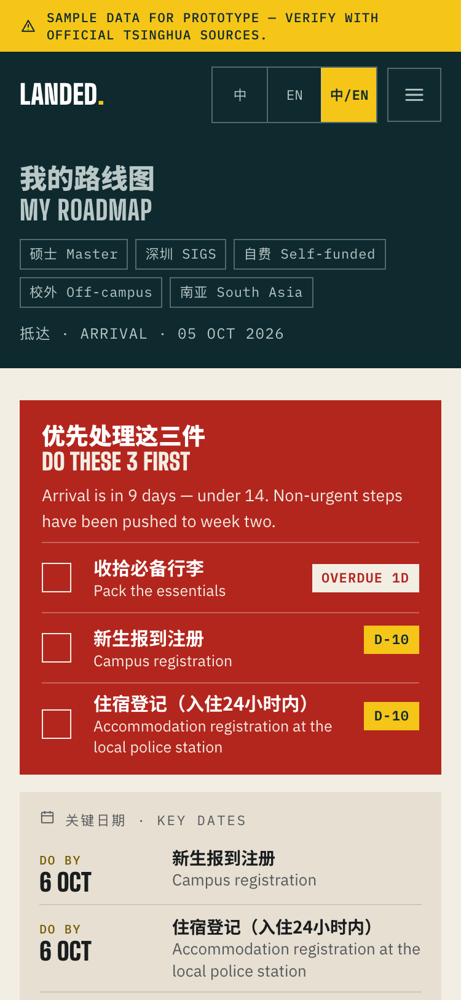

# Landed 落地清华

**从录取通知书到宿舍钥匙，一步不慌**
**From offer letter to dorm key — no surprises.**

> 真正的落地，不是拿到录取通知书，而是下一步永远心里有数。
> Real arrival isn't getting the offer letter. It's knowing your next step before you need it.

**Live demo:** https://muneeb-alvi.github.io/landed/

---

## What this is

A clickable MVP prototype. For incoming international students at Tsinghua, Landed
helps them plan their move without surprises by building a personalized roadmap of
documents, dorm costs and realistic timelines, crowdsourced from current students.

Official information is scattered and generic. The real timelines, costs and gotchas
live in group chats. Landed is a **roadmap engine** plus a **community** of current
students who annotate it.

### Surprises it prevents

| | |
|---|---|
| 顺序错了 | A step needs a document you only get from another step. |
| 低估时间 | "Five working days" becomes three weeks in September. |
| 隐藏开销 | Deposits, bedding, health check, SIM and transport land before the first stipend. |
| 无法付款 | No local bank card yet, but things already require one. |
| 过时信息 | Last year's advice repeated as if it were still true. |

### How it works

**Roadmap Engine.** Six answers produce three things: an ordered step list with deadlines
counted back from the arrival date, a document checklist, and a first-30-day cost estimate.

**Student Intel.** Every step carries notes from recent students. Each note gives a real
duration, a cost and one tip, tagged with cohort and date.

### The five stages

`01 录取确认 Offer` → `02 签证办理 Visa` → `03 行前准备 Pre-departure` →
`04 抵达首周 Arrival week` → `05 第一个月 First month`

---

## Screenshots

| Landing | Onboarding | Roadmap |
|---|---|---|
|  |  |  |

| Step detail | Late arrival (under 14 days) |
|---|---|
|  |  |

---

## Personalization

Six questions — region, degree, campus, arrival date, funding, housing — plus an
optional "coming with family?" toggle. Deadlines are computed as
`arrivalDate + offsetDays`, where negative offsets fall before arrival.

| Answer | What changes |
|---|---|
| **Exchange** (one semester) | X2 visa replaces X1; residence permit, bank account and health verification steps are hidden; short-stay tips appear. |
| **Off-campus** | Adds "accommodation registration at the local police station within 24h of arrival" and an off-campus housing search; drops the dorm application. |
| **Coming with family** | Adds dependent visa (S1/S2) and dependent registration steps, merged into the same timeline. |
| **Self-funded** | Adds a "bring enough cash/card access" step and a week-by-week cash-flow card for the first 30 days. |
| **Arrival under 14 days away** | Shows a "Do these 3 first" banner and pushes non-urgent steps to week two. |
| **Campus** (Beijing / SIGS) | Reorders student notes so matching-campus cohorts surface first. |

A baseline master's student sees 17 steps; exchange sees 14; with family, 19.

---

## Sample data

**Every cost, wait time and student note in this prototype is fictional sample content.**
It is not sourced from Tsinghua University. Official source links are deliberate
placeholders. A persistent banner says so on every screen.

Seed data lives in [`src/data/steps.js`](src/data/steps.js) — 23 steps across the five
stages, each with `officialRequirement`, `officialSourceUrl`, `realWait`, `costCNY`
and 2–3 student notes carrying a cohort tag and date.

### Trust rules

- Every note shows a cohort tag, e.g. "Fall 2026 · SIGS".
- Official requirements link to an official source. Student notes add timing and cost;
  they never replace the rules.
- Within each step, notes matching your campus sort first, then newest first. Notes
  older than 18 months are flagged "可能过时 · May be outdated".

---

## Running it

```bash
npm install
npm run dev      # http://localhost:5173/landed/
```

```bash
npm run build    # production build into dist/
npm run preview  # serve the production build at /landed/
```

Requires Node 20+.

## Tech

Vite + React (JavaScript), no backend. `HashRouter` so a refresh never 404s on GitHub
Pages, and `base: '/landed/'` in `vite.config.js`. Checkbox progress, answers, upvotes
and "this changed" flags are stored in `localStorage` and are local to the device.

Deployed by [`.github/workflows/deploy.yml`](.github/workflows/deploy.yml) on every push
to `main`, using the official `configure-pages` / `upload-pages-artifact` / `deploy-pages`
actions.

## Out of scope

Login, real contributor posting, a backend, and live official data.
