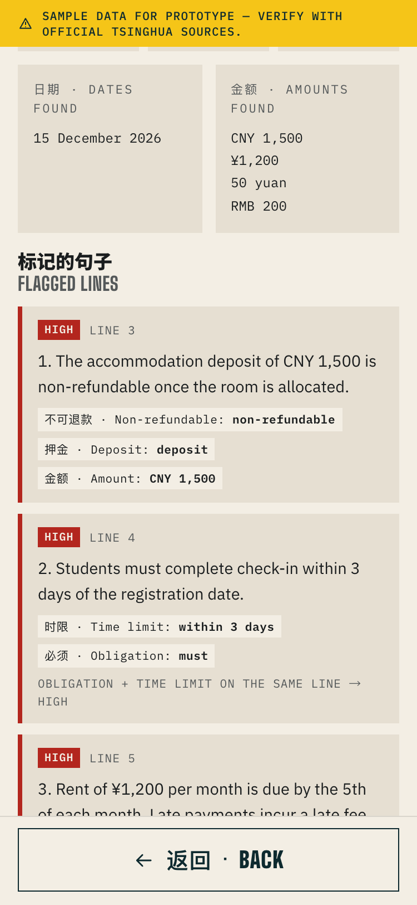
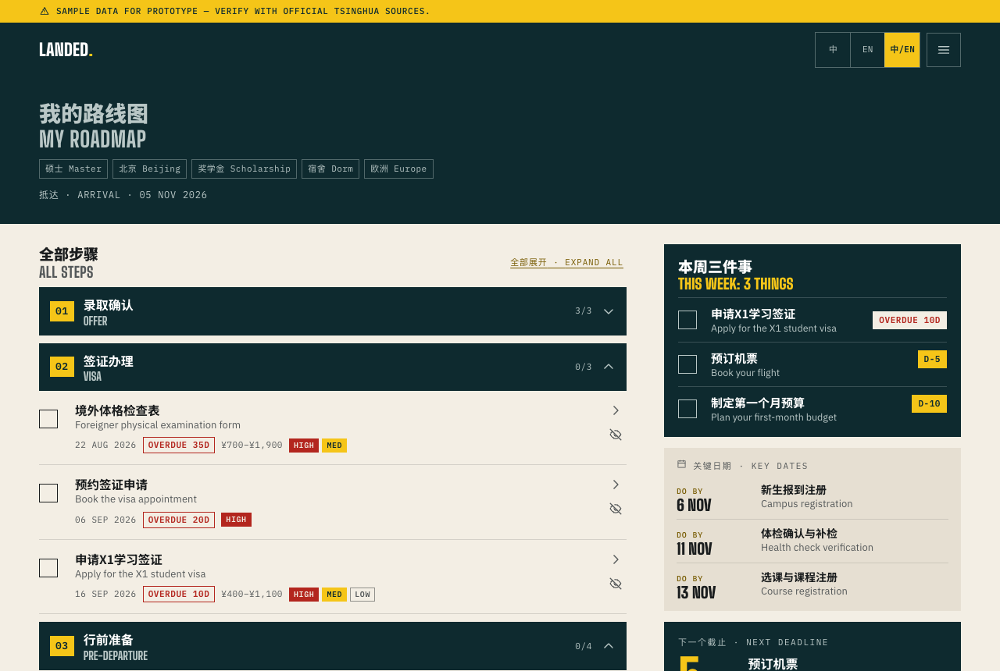
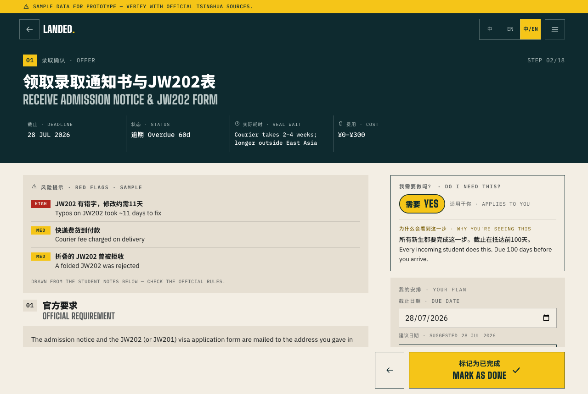

# Landed 落地清华

**从录取通知书到宿舍钥匙，一步不慌**
**From offer letter to dorm key — no surprises.**

> 真正的落地，不是拿到录取通知书，而是下一步永远心里有数。
> Real arrival isn't getting the offer letter. It's knowing your next step before you need it.

**Live demo:** https://muneeb-alvi.github.io/landed/

---

## What this is

A clickable prototype. For incoming international students at Tsinghua, Landed
helps them plan their move without surprises by building a personalized roadmap of
documents, dorm costs and realistic timelines, crowdsourced from current students.

Official information is scattered and generic. The real timelines, costs and gotchas
live in group chats. Landed is a **roadmap engine** plus a **community** of current
students who annotate it.

### Surprises it prevents

| | |
|---|---|
| 顺序错了 | A step needs a document you only get from another step. |
| 低估时间 | "Five working days" becomes three weeks in September. |
| 隐藏开销 | Deposits, bedding, health check, SIM and transport land before the first stipend. |
| 无法付款 | No local bank card yet, but things already require one. |
| 过时信息 | Last year's advice repeated as if it were still true. |

### How it works

**Roadmap Engine.** Six answers produce an ordered step list with deadlines counted back
from the arrival date, a document checklist and a first-30-day cost estimate. Every step
says whether you need it — **YES**, **NO** (with the reason) or **MAYBE** (one follow-up
question decides it) — and why you are seeing it.

**Student Intel.** Every step carries notes from recent students — a real duration, a
cost and one tip, tagged with cohort, campus and date — plus red flags drawn from what
went wrong for them.

### The five stages

`01 录取确认 Offer` → `02 签证办理 Visa` → `03 行前准备 Pre-departure` →
`04 抵达首周 Arrival week` → `05 第一个月 First month`

---

## Features

**Roadmap**
- **本周三件事 This week: 3 things** — the three unfinished steps nearest today, with
  days-left labels and one-tap checkboxes. Turns red ("Do these 3 first") when arrival is
  under 14 days away.
- **关键日期 Key dates** — the next three fixed deadlines (legal clocks and closing
  windows) as "Do by 24 Sep".
- Countdown to the next deadline, cost estimates (before you fly / first 30 days / later),
  progress, and a week-by-week cash-flow card for self-funded students.
- Collapsible stages: only the stages holding this week's steps start open.
- **Editable:** hide a step ("not relevant to me", with undo and a *Hidden steps* list),
  move its due date (the suggested date stays visible), add your own steps (title, date,
  stage, cost), and keep private notes on any step. All of it counts in totals and progress.
- *Not for you* — every step your answers rule out, with the reason.
- **证件清单 Document checklist** of the documents your steps ask for.
- **Export:** *Add deadlines to calendar* downloads an `.ics` of unfinished steps (all-day
  events with a one-day reminder). *Print / Save as PDF* uses a print stylesheet with every
  stage expanded and the checklist on its own page.

**Step detail**
- YES / NO / MAYBE verdict with a generated "why you're seeing this" line. MAYBE asks one
  question inline; answering it updates the roadmap.
- HIGH / MED / LOW red flags, official requirement (placeholder link), short-stay tip.
- Student notes with cohort tag, "Verified current student" badge, upvote and
  "this changed" flag. Sort by *Most relevant*, *Newest* or *Most upvoted*.
- *Share a tip* — saved on this device only, marked "Your tip · only on this device",
  deletable.

**Check a document** — paste an admission letter, dorm contract or email. A rule-based scan
(no AI, no network) pulls out dates, money amounts and risky phrases (non-refundable,
penalty, auto-renew, deadline, within X days, must — English and Chinese) and flags each
line HIGH / MED / LOW. An obligation with a time limit on the same line is escalated to
HIGH. Labelled "Rule-based check. Always read the original." Nothing is uploaded.

**Everywhere**
- 中 / EN / Both language toggle (default Both, remembered).
- Onboarding with a review screen and edit links; four use-case cards on the landing page
  open onboarding pre-filled for that persona.
- Menu with *About the data* and *Start over* (clears all local data after confirmation).
- Responsive: phone layout below 900px; two columns on desktop with a sticky summary.
- Accessible: semantic landmarks and headings, skip link, labelled icon buttons, 44px tap
  targets, visible focus rings, `prefers-reduced-motion` respected. axe-core reports no
  WCAG 2.1 A/AA violations on any screen at 375px or 1280px.

---

## Screenshots

| Landing | Onboarding review | Roadmap |
|---|---|---|
|  |  |  |

| Step detail (MAYBE) | Check a document | Late arrival (under 14 days) |
|---|---|---|
|  |  |  |

| Desktop roadmap | Desktop step detail |
|---|---|
|  |  |

---

## Personalization

Six questions — region, degree, campus, arrival date, funding, housing — plus an
optional "coming with family?" toggle. Deadlines are computed as
`arrivalDate + offsetDays`, where negative offsets fall before arrival. A student can then
move any deadline by hand.

| Answer | What changes |
|---|---|
| **Exchange** (one semester) | X2 visa replaces X1; residence permit, bank account and health verification move to *Not for you* with reasons; the physical exam becomes MAYBE ("Will you stay longer than 180 days?"); short-stay tips appear. |
| **Off-campus** | Adds accommodation registration at the local police station within 24h of arrival and an off-campus housing search; drops the dorm application. |
| **Coming with family** | Adds dependent visa (S1/S2) and dependent registration steps, and the relationship documents to the checklist, merged into the same timeline. |
| **Self-funded** | Adds a "bring enough cash/card access" step and a week-by-week cash-flow card for the first 30 days. |
| **Scholarship** | The cash step is MAYBE ("Will your scholarship pay out before your first week?"). |
| **Arrival under 14 days away** | The this-week card turns red ("Do these 3 first") and non-urgent steps move to week two. |
| **Campus** (Beijing / SIGS) | *Most relevant* note sorting puts matching-campus cohorts first. |

A master's student on a scholarship in a dorm sees 18 steps (17 once the MAYBE is
answered "yes"); off campus, 19; with family, 20; exchange, 15 (13 once both MAYBEs are
answered for a short, funded stay).

---

## Sample data

**Every cost, wait time, red flag, "verified" badge and student note in this prototype is
fictional sample content.** It is not sourced from Tsinghua University. Official source
links are deliberate placeholders. A persistent banner says so on every screen, and the
*About the data* page explains it.

Seed data lives in [`src/data/steps.js`](src/data/steps.js) — 23 steps across the five
stages, each with `officialRequirement`, `officialSourceUrl`, `realWait`, `costCNY`,
2–3 student notes, and sample `redFlags` that restate what those notes already say.
Optional fields: `hard` (a fixed deadline, for *Key dates*), `skipReason` and `maybeIf`
(for the verdict). The document checklist is in
[`src/data/documents.js`](src/data/documents.js), drawn from the same requirements.

### Trust rules

- Every note shows a cohort tag, e.g. "Fall 2026 · SIGS".
- Official requirements link to an official source. Student notes add timing and cost;
  they never replace the rules.
- *Most relevant* (default) sorts notes from your campus first, then newest, then most
  upvoted. Notes older than 18 months are flagged "可能过时 · May be outdated".
- "Verified current student" is a sample flag for the idea of a claimed, confirmed
  profile. No verification exists yet.

---

## Running it

```bash
npm install
npm run dev      # http://localhost:5173/landed/
npm test         # Vitest: roadmap engine, verdicts, document scanner, .ics output
```

```bash
npm run build    # production build into dist/
npm run preview  # serve the production build at /landed/
```

Requires Node 20+.

## Tech

Vite + React (JavaScript), no backend. `HashRouter` so a refresh never 404s on GitHub
Pages, and `base: '/landed/'` in `vite.config.js`.

Logic lives in small pure modules in [`src/lib`](src/lib):
`roadmap.js` (the engine), `verdict.js` (YES/NO/MAYBE and why-lines), `docscan.js`
(document check), `ics.js` (calendar export), `date.js`, `storage.js`.

Everything the student does is stored in `localStorage` on their device, one key per
kind of data (`landed.answers.v1`, `landed.checked.v1`, `landed.hidden.v1`,
`landed.due.v1`, `landed.custom.v1`, `landed.mynotes.v1`, `landed.followups.v1`,
`landed.tips.v1`, `landed.upvotes.v1`, `landed.flags.v1`, `landed.docs.v1`,
`landed.lang.v1`). The version suffix is bumped, with a migration in `storage.js`,
whenever a key's shape changes.

Deployed by [`.github/workflows/deploy.yml`](.github/workflows/deploy.yml) on every push
to `main`, using the official `configure-pages` / `upload-pages-artifact` / `deploy-pages`
actions.

## Out of scope

Login, real contributor posting and verification, a backend, live official data, and
AI document reading.
